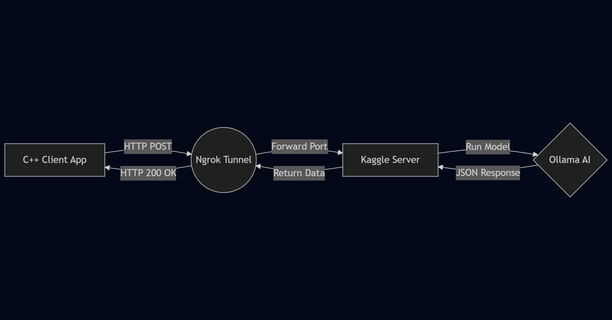
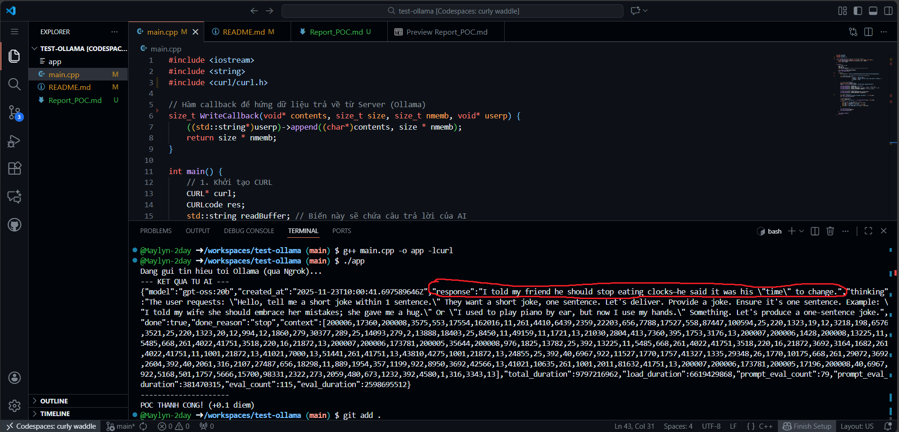

# BÁO CÁO ĐỀ XUẤT ĐỒ ÁN & KẾT QUẢ THỰC NGHIỆM (POC)

**Tên đồ án:** *Ollama-HPP (C++ Client for Large Language Models)*  
**Giảng viên hướng dẫn:** *Ths Trần Duy Quang*    
**Sinh viên thực hiện:** *Lê Nguyễn Thùy Linh*    
**MSSV:** *24120085*  

---

## 1. TỔNG QUAN ĐỀ TÀI (PROJECT PROPOSAL)

### 1.1. Đặt vấn đề và Mục tiêu
Hiện nay, việc tích hợp các mô hình ngôn ngữ lớn (LLM) vào ứng dụng phần mềm đang là xu hướng. Tuy nhiên, việc chạy các mô hình này đòi hỏi phần cứng mạnh mẽ, gây khó khăn cho các ứng dụng chạy trên máy cá nhân cấu hình thấp.

**Mục tiêu của đồ án:**
Xây dựng một thư viện C++ (`ollama.hpp`) tối giản, hoạt động theo cơ chế Client-Server. Thư viện này cho phép các lập trình viên C++ kết nối dễ dàng tới Ollama API đang chạy trên một máy chủ từ xa (Remote Server) hoặc máy ảo đám mây (Cloud), giúp tận dụng sức mạnh AI mà không làm nặng máy Client.

### 1.2. Kiến trúc hệ thống
Hệ thống hoạt động dựa trên mô hình Client-Server kết hợp Tunneling:

* **Client (Local Machine):** Ứng dụng C++ sử dụng thư viện `libcurl` để gửi yêu cầu HTTP (Request).
* **Tunneling (Ngrok):** Giải pháp mạng giúp công khai cổng dịch vụ (port) từ môi trường server ra internet một cách an toàn.
* **Server (Kaggle/Cloud):** Môi trường thực thi mô hình Ollama (ví dụ: model `gpt-oss:20b`), chịu trách nhiệm xử lý tính toán nặng.  


*Hình 1: Sơ đồ hệ thống hoạt động*   

### 1.3. Lộ trình phát triển (Roadmap)
* **Giai đoạn 1 (0.1 điểm - Đã hoàn thành):** Thiết lập môi trường Kaggle, cấu hình Ngrok và xây dựng Client C++ cơ bản để chứng minh khả năng kết nối (POC).
* **Giai đoạn 2 (MVP):** Phát triển giao diện Console tương tác, xử lý chuỗi JSON trả về để hiển thị nội dung chat tự nhiên.
* **Giai đoạn 3 (Final):** Đóng gói thành thư viện Header-only, tối ưu hóa code, xử lý các ngoại lệ mạng (Timeout, Connection Refused).

---

## 2. KẾT QUẢ THỰC NGHIỆM (PROOF OF CONCEPT)

### 2.1. Thiết lập môi trường
* **Server Side:** Sử dụng Kaggle Notebook (GPU T4 x2) để chạy Ollama server.
* **Networking:** Ngrok Tunnel được thiết lập để forward port `11434` ra Public Internet.
* **Client Side:** Mã nguồn C++ được biên dịch trên môi trường Linux (Ubuntu/Codespaces) sử dụng trình biên dịch `g++` và thư viện `libcurl`.

### 2.2. Mã nguồn kiểm thử (POC Code)
Đoạn mã dưới đây thực hiện việc gửi một bản tin JSON tới API `/api/generate` của Ollama và nhận về phản hồi thô.

```cpp
// Trích đoạn mã nguồn main.cpp
#include <iostream>
#include <string>
#include <curl/curl.h>

// ... (Các hàm callback xử lý dữ liệu)

int main() {
    // URL Ngrok tunnel (Dynamic)
    std::string url = "https://<your-ngrok-id>.ngrok-free.dev/api/generate";
    
    // JSON Payload gửi đi
    std::string json_data = "{\"model\": \"gpt-oss:20b\", \"prompt\": \"Tell me a joke\", \"stream\": false}";

    // ... (Thực hiện curl_easy_perform)
}   
```   
### 2.3. Minh chứng kết quả
Hệ thống đã kết nối thành công. Client nhận được phản hồi HTTP 200 OK kèm theo dữ liệu JSON chứa nội dung câu trả lời từ AI.

Hình ảnh thực tế:  
  
*Hình 2: Kết quả trả về từ Server Ollama hiển thị nội dung JSON hợp lệ trên Terminal của Client.*  
---
## 3. KẾT LUẬN VÀ HƯỚNG PHÁT TRIỂN
Giai đoạn Proof of Concept đã hoàn thành đúng yêu cầu đề ra:
1.  Đã thiết lập thành công đường hầm (Tunnel) kết nối an toàn giữa máy tính cá nhân và máy chủ Kaggle.
2.  Client C++ đã gửi được Request và nhận về Response từ mô hình ngôn ngữ lớn.
3.  Sẵn sàng cho giai đoạn tiếp theo: Xử lý chuỗi JSON và hoàn thiện giao diện người dùng.

**Link Source Code (GitHub):** [Dán link GitHub của bạn vào đây]